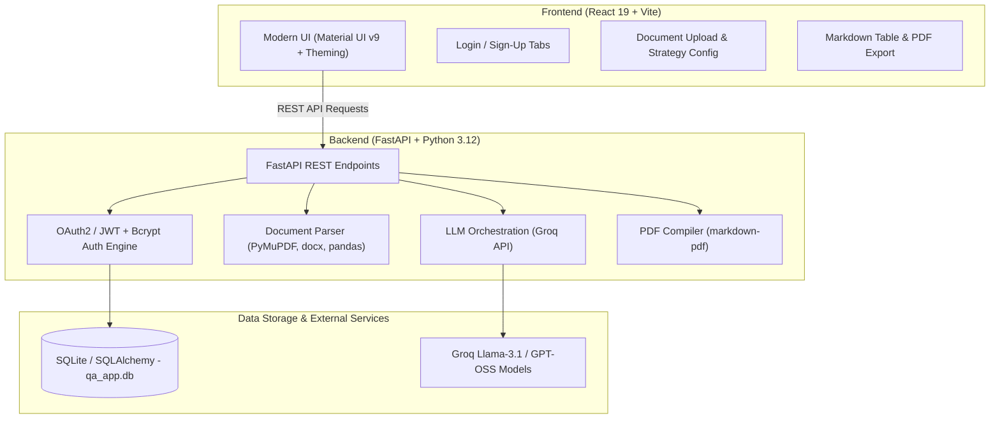
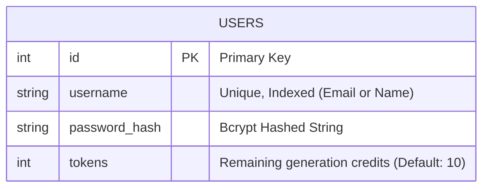

# Software Requirements Specification (SRS)
## Project Name: Mythra Bloom — Intelligent QA & Test Case Generation Engine

---

### Document Information
- **Project Name:** Mythra Bloom (WebsiteTester)
- **Version:** 1.0.0
- **Status:** Approved / Baseline
- **Target Release:** 2026-Q4
- **Target Audience:** Product Managers, QA Engineers, Full-Stack Developers, DevSecOps

---

## 1. Executive Summary & Vision

### 1.1 Purpose
The **Mythra Bloom QA Engine** is an AI-powered quality assurance automation tool designed to bridge the gap between product requirements and comprehensive software testing. It accelerates testing lifecycles by automatically analyzing specifications, user stories, and technical documents (PDF, DOCX, CSV, or raw text) and transforming them into structured, production-ready QA test cases (Standard Step-by-Step test matrices and BDD Gherkin scenarios).

### 1.2 Problem Statement
Traditional QA test planning requires significant manual effort: reading product requirement documents (PRDs), extracting edge cases, formatting test tables, and maintaining consistency across functional, UI/UX, security, and performance domains. Mythra Bloom eliminates this bottleneck by reducing test plan authoring time from hours to seconds while enforcing structured test design patterns.

---

## 2. System Architecture & Tech Stack

### 2.1 Technology Stack
- **Frontend:** React 19, Vite, Material UI (MUI v9), Emotion, React Markdown, React Router v7, Axios.
- **Backend:** FastAPI, Python 3.12, Uvicorn, SQLAlchemy ORM, Pydantic v2.
- **Authentication & Security:** JSON Web Tokens (JWT via python-jose), Bcrypt password hashing, OAuth2 Password Bearer.
- **Document Processing:** PyMuPDF (`fitz`), `python-docx`, `pandas` (CSV parser).
- **AI Core:** Groq Cloud API (`openai/gpt-oss-20b`, `llama-3.1-8b-instant`, `qwen/qwen3.8-27b`).
- **Exporting:** `markdown-pdf` with PyMuPDF rendering backend.
- **Database:** SQLite (`qa_app.db`) for lightweight local persistence (pluggable PostgreSQL support).

---

## 3. User Roles & Personas

| Role | Description | Key Objectives |
| :--- | :--- | :--- |
| **QA Engineer / SDET** | Primary test architect | Upload specifications, generate test matrices, export PDF test suites, verify edge cases. |
| **Product Manager (PM)** | Specification author | Validate requirement testability, ensure coverage of user stories and acceptance criteria. |
| **Full-Stack Developer** | Feature developer | Generate unit/integration test plans and BDD Gherkin scenarios before implementing code. |
| **Admin / System** | System manager | Monitor user quotas, token deductions, and API availability. |

---

## 4. Functional Requirements (FR)

### Module 1: User Management & Authentication

- **FR-1.1: User Registration (Sign Up)**
  - System shall allow new users to register with a unique `username` (or email) and `password`.
  - Client and server shall enforce validation:
    - Username: 3–50 characters (alphanumeric, `.`, `_`, `@`, `-`, `+`).
    - Password: Minimum 6 characters.
    - Confirm Password: Must match password field before dispatch.
  - Server shall hash passwords using `bcrypt` with dynamic salting.
  - Upon successful registration, the user receives an initial credit of **10 free AI generation tokens**.

- **FR-1.2: User Authentication (Sign In)**
  - System shall authenticate users via OAuth2 form data against stored password hashes.
  - Upon successful validation, the system shall issue a signed `HS256` JSON Web Token (JWT) with a 24-hour expiration window.
  - Client shall persist the token securely in `localStorage` and transmit it via `Authorization: Bearer <token>` headers.

- **FR-1.3: User Profile & Token Balance**
  - System shall provide a `GET /api/me` endpoint to fetch the logged-in user's identity and remaining token balance.
  - Client shall redirect unauthenticated users to `/login`.

- **FR-1.4: Sign Out**
  - Client shall provide a one-click Sign Out option that clears stored tokens and invalidates the session.

---

### Module 2: Requirement Ingestion & Document Parsing

- **FR-2.1: Multi-Format Document Upload**
  - System shall accept requirement documents in the following formats:
    - **PDF (`.pdf`)**: Extracted via PyMuPDF text stream extraction.
    - **Word Document (`.docx`)**: Extracted via paragraph iteration.
    - **CSV (`.csv`)**: Extracted and structured via Pandas tabular conversion.
  - System shall enforce a maximum file upload limit of **10MB**.
  - System shall reject unsupported file formats with descriptive HTTP 400 errors.

- **FR-2.2: Free-Form Text & URL / Story Input**
  - System shall provide an interactive multi-line text input for pasting user stories, acceptance criteria, or web URLs.
  - Direct input shall support up to 25,000 characters per request.

- **FR-2.3: Ephemeral File Handling**
  - All uploaded files stored temporarily on the server filesystem must be immediately closed and deleted after parsing to prevent resource leaks and unauthorized data retention.

---

### Module 3: Strategy & Test Configuration

- **FR-3.1: Output Format Selection**
  - Users shall be able to choose between:
    1. **Standard (Step-by-Step)**: Tabular matrix including `Test ID`, `Description`, `Steps to Execute`, and `Expected Result`.
    2. **BDD (Given-When-Then)**: Gherkin format structured with `Feature`, `Scenario`, `Given`, `When`, and `Then`.

- **FR-3.2: Multi-Domain Focus Area Toggles**
  - Users shall be able to select one or multiple focus dimensions:
    - **Functional Testing** (Default: Enabled)
    - **UI/UX & Accessibility** (Default: Enabled)
    - **Security & Vulnerability Testing** (Default: Disabled)
    - **Performance & Load Testing** (Default: Disabled)
    - **Edge Cases & Negative Scenarios** (Default: Enabled)

---

### Module 4: AI Generation Engine & Prompt Security

- **FR-4.1: Prompt Orchestration & Anti-Injection Defense**
  - Raw user input shall be wrapped in passive `<user_content>` delimiters with anti-jailbreak directives to prevent prompt injection and system override.
  - The AI prompt shall strictly demand pure Markdown output structured by the user's selected focus areas.

- **FR-4.2: Model Fallback & Execution**
  - The backend shall connect to Groq AI inference. If the primary model (`openai/gpt-oss-20b`) is busy or unavailable, the backend shall automatically fall back to secondary models (`qwen/qwen3.8-27b` / `llama-3.1-8b-instant`).

- **FR-4.3: Token Deduction & Quota Management**
  - Each successful test generation execution shall decrement the user's token balance by 1.
  - If a user has `0` tokens, the backend shall block generation with HTTP 403 (`Insufficient tokens`).

---

### Module 5: Visualization, Export & Sharing

- **FR-5.1: Markdown Rendering**
  - Generated test plans shall be rendered dynamically in the UI with styled headings, code blocks, checklists, and formatted data tables.

- **FR-5.2: PDF Export**
  - System shall compile Markdown test plans into downloadable PDF documents (`Mythra_Generated_Test_Cases.pdf`) via `POST /api/download-pdf`.
  - File descriptors must be properly closed on Windows/Linux to avoid file-lock errors.

- **FR-5.3: Clipboard Copy**
  - System shall provide a one-click copy button with real-time visual confirmation to paste test cases into Jira, TestRail, Notion, or GitHub Issues.

---

## 5. Non-Functional Requirements (NFR)

### 5.1 Performance & Scalability
- **NFR-1.1:** Non-blocking asynchronous I/O (`run_in_threadpool`) for heavy file parsing, LLM calls, and PDF compilation.
- **NFR-1.2:** LLM generation response latency shall not exceed 10 seconds under standard Groq API conditions.
- **NFR-1.3:** Client-side bundle size shall remain under 1MB gzip compressed.

### 5.2 Security & Privacy
- **NFR-2.1:** Passwords must be hashed using `bcrypt` (work factor 12). Raw passwords shall never be logged or stored.
- **NFR-2.2:** JWT secrets must be loaded via `.env` environment variables.
- **NFR-2.3:** Anti-prompt injection filters sanitize tags and prevent execution of active scripts.
- **NFR-2.4:** Uploaded customer documents must not be persisted permanently in database or storage.

### 5.3 Reliability & Fault Tolerance
- **NFR-3.1:** All API validation errors (HTTP 400/422) must be returned as clean human-readable JSON strings (`{"detail": "..."}`) to prevent client UI crashes.
- **NFR-3.2:** Database operations use ACID transactions with auto-rollback on generation failures.

### 5.4 Usability & Accessibility
- **NFR-4.1:** Responsive layout supporting mobile ($375\text{px}$+), tablet, and desktop viewports ($1920\text{px}$).
- **NFR-4.2:** Material Design principles, distinct visual feedback (spinners, alert notifications, disabled button states during async tasks).

---

## 6. Data Model & Database Schema

---

## 7. REST API Endpoints Specification

| Method | Endpoint | Description | Auth Required | Request Body / Params | Expected Response |
| :--- | :--- | :--- | :--- | :--- | :--- |
| `POST` | `/api/signup` | Register a new user account | No | `{"username": "...", "password": "..."}` | `200 OK`: `{"message": "..."}` |
| `POST` | `/api/login` | Authenticate & get JWT token | No | Form Data: `username`, `password` | `200 OK`: `{"access_token": "...", "token_type": "bearer"}` |
| `GET` | `/api/me` | Fetch user info & token balance | Yes (Bearer) | None | `200 OK`: `{"username": "...", "tokens": 10}` |
| `POST` | `/api/extract-text` | Parse PDF/DOCX/CSV file | Yes (Bearer) | Multipart `file` (Max 10MB) | `200 OK`: `{"extracted_text": "..."}` |
| `POST` | `/api/generate-tests` | Generate AI QA test plan | Yes (Bearer) | `{"text_context": "...", "format_style": "...", "focus_areas": [...]}` | `200 OK`: `{"markdown": "...", "tokens_remaining": 9}` |
| `POST` | `/api/download-pdf` | Compile markdown into PDF | No | `{"markdown": "..."}` | `200 OK`: `application/pdf` binary stream |

---

## 8. Verification & Acceptance Criteria

1. **User Auth Verification:**
   - User can register at `/signup` with valid username and $\ge 6$ char password.
   - User receives 10 starting tokens upon account creation.
   - User cannot register duplicate usernames.
2. **File Processing Verification:**
   - Valid PDF, DOCX, and CSV files are parsed cleanly into textual requirements.
   - Corrupted or invalid files yield clean error alerts without crashing the backend.
3. **QA Generation Verification:**
   - Both **Standard Tables** and **BDD Gherkin** output formats are generated strictly according to selected focus areas.
   - Token balance decrements correctly by 1 after each successful run.
4. **Export Verification:**
   - Clicking "Download PDF" streams a valid `.pdf` document without file lock collisions on Windows or Linux.
   - Clicking "Copy" copies the exact markdown to the system clipboard.
